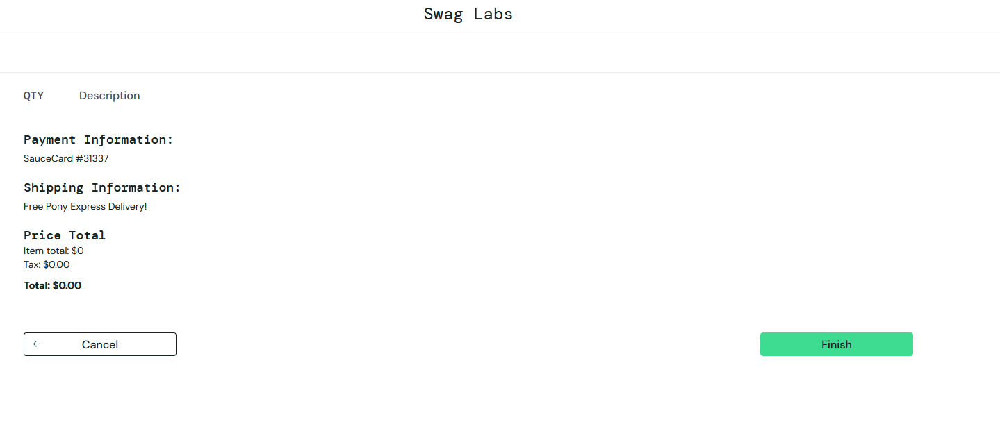

# BUG_REPORT.md

## Broken Images in Inventory

**Severity:** High  
**User(s) affected:** problem_user  
**Environment:** Chromium, Windows 10

### Steps to Reproduce
1. Login as `problem_user`.  
2. Navigate to the Inventory page.  
3. Observe product images.

### Expected Result
All product images should display correctly.

### Actual Result
Some product images are broken or repeated.

### Evidence

### Notes
Occurs only for `problem_user`. Standard user images load correctly.

---

## Checkout Allowed with Empty Cart

**Severity:** High  
**User(s) affected:** standard_user  
**Environment:** Chromium, Windows 10

### Steps to Reproduce
1. Login as `standard_user`.  
2. Navigate to the Cart page with no items added.  
3. Click the Checkout button.

### Expected Result
The user should not be able to proceed to checkout; the app should show a message or disable the button.

### Actual Result
The app allows proceeding to the Checkout page even when the cart is empty.

### Evidence

### Notes
This could allow orders with no items, which is a critical edge case.